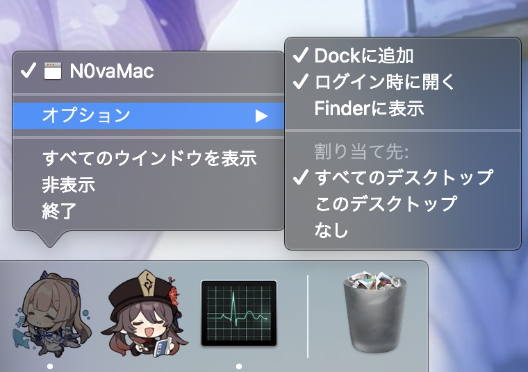

# N0vaMac
Desktop Live Wallpaper tool for macOS 

https://user-images.githubusercontent.com/958174/151774363-44f1ddfd-2279-442c-9c31-34970937d52d.mov

## できること
* WindowsとAndroidしかサポートしていない[N0va Desktop](https://n0vadp.mihoyo.com/)の一部ライブ背景をMacのデスクトップ背景として使えるようにします。
* 現在利用できるのは原神の一部ライブ壁紙です。Lumi、他のゲームは対応していません。
* 音声は再生しません。

## 動作環境

### Intel 
* MacBookPro Intel macOS Catalina 10.15
* MacBookPro Intel macOS Mojave 10.14
* MacBookPro Apple M1 Pro macOS Monterey 12.2

## ダウンロード
* Intel版 -> [こちらから](https://github.com/yoshidan/N0vaMac/releases)最新版のN0vaMac.zipをダウンロードして開いてください。
* M1版 -> [こちらから](https://github.com/yoshidan/N0vaMac/releases)最新版のN0vaMac_M1.zipをダウンロードして開いてください。
  
解凍すると以下の二つのアプリがあります。
  
* N0vaMac
  - 動画を壁紙にするツールです。
* N0vaMacConfig 
  - N0vaDesktopのライブ壁紙をダウンロードしたり壁紙を変更するためのツールです。

## N0vaMacの使い方
* N0vaMacを起動してください。デフォルトで背景に動く胡桃が画面全体の背景に表示されればOKです。
* Dockに珊瑚宮心海が表示されます。
  - 右クリックして「オプション」→ 「全てのデスクトップ」を選択してください。全デスクトップの背景に適用されます。
  - 「ログイン時に開く」を選択しておくと、再起動時に自動的にアプリケーションを起動します。
  

## N0vaMacConfig
* N0vaMacConfigを起動したら、背景設定したい動画のサムネイルのDownloadボタンを押してください。
  - ファイルサイズが大きい場合は分割してダウンロードします。「Downloading...(6/6)」などとなってからさらに数十秒かかるので少しお待ちください。
* 完了したらDownloadの表記がSelectに変わります。Selectを選択すると背景が切り替わります。
* N0vaMacConfigは背景変更する時だけ起動しておけばいいです。常時起動しておく必要はありません。

https://user-images.githubusercontent.com/958174/152636903-302dd443-9947-47b2-b0de-01dee598f5b0.mov
  
## その他
* デスクトップを追加した場合、一度Dockのアイコンを選択すると追加したデスクトップにも反映されます。
* 外付けデスクトップによる拡張は対応していません。拡張先には背景が適用されないです。ミラーリングは解像度が同じであれば問題ありません。
* N0vaMacConfigでSelectしても反映されない場合、localhost:9025が他のプロセスに使われている可能性があります。
  - 頻繁に発生するようでしたらissue立ててください。ポート変更できるようにします。 
